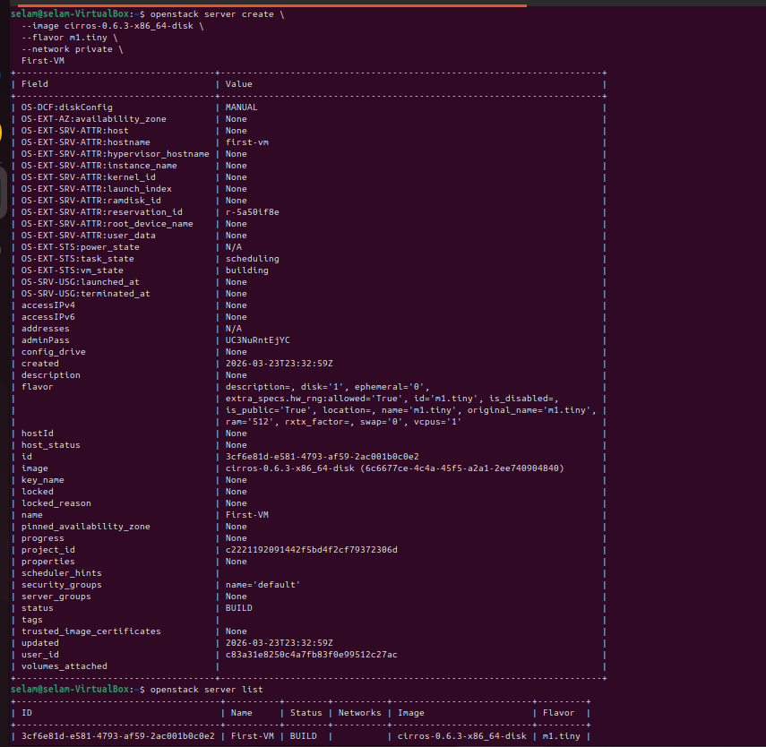

# First Virtual Machine Creation on OpenStackS

---

## Overview

Successfully created first virtual machine using OpenStack CLI. This validates the core OpenStack services: Nova (compute), Glance (images), and Neutron (networking).

---

## Resources Used

| Resource | Name | Details |
|----------|------|---------|
| **Image** | cirros-0.6.3-x86_64-disk | Lightweight test OS |
| **Flavor** | m1.tiny | 512MB RAM, 1 vCPU, 1GB disk |
| **Network** | private | 10.0.0.0/24 subnet |
| **Key Pair** | my-first-key | SSH authentication |

---
## Commands Used

```bash
# Source credentials
source ~/openrc

# List available resources
openstack image list      # Images available
openstack flavor list     # Hardware templates
openstack network list    # Networks available

##  Launch VM
openstack server create \
  --image cirros-0.6.3-x86_64-disk \
  --flavor m1.tiny \
  --network private \
  --key-name my-first-key \
  first-vm-cli

## Verify VM Status
	openstack server list

##OpenStack Services Used
| Service | Purpose |
|---------|---------|
| Glance | Provides OS images |
| Nova | Creates and manages VMs |
| Neutron | Handles networking |
| Keystone | Manages authentication |

## Results : VM Successfully Created


