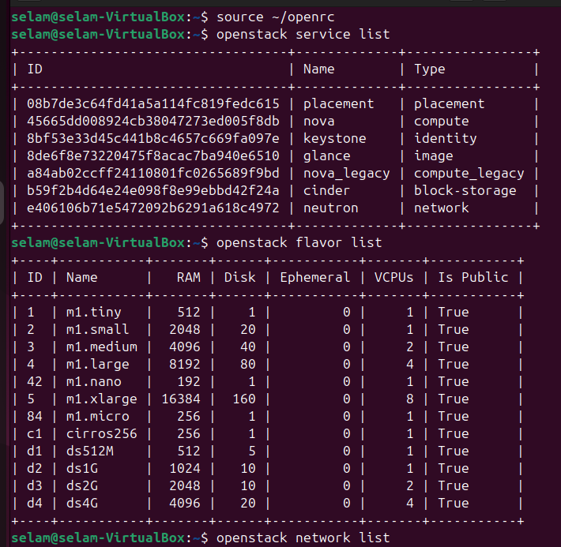
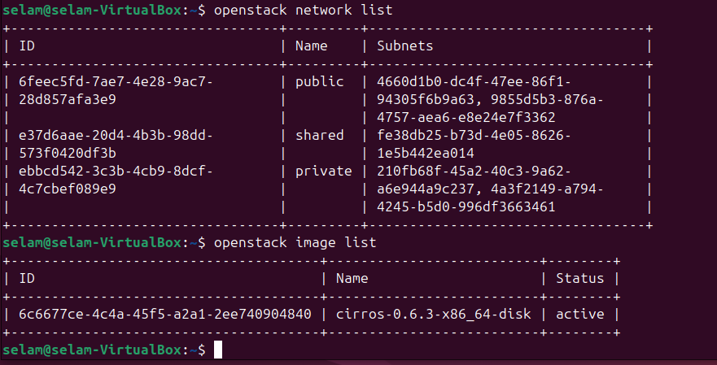

# OpenStack Environment Verification

## Objective
Verify OpenStack services and resources before launching the first VM.

---

##  OpenStack Services and  Flavors

---

##  Networks and Images

---

##  Observations

- All core OpenStack services are running
- Default network (private) is available
- Cirros image is ready for instance creation
- Flavors define compute resource allocation

---

##  Status

System ready for VM deployment
